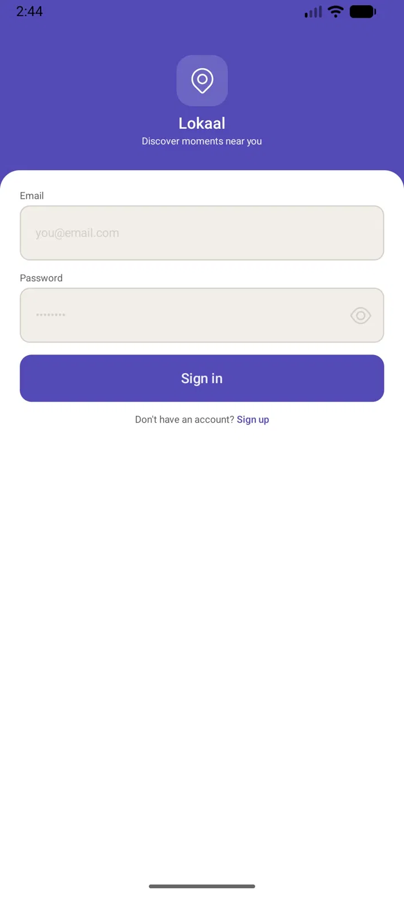
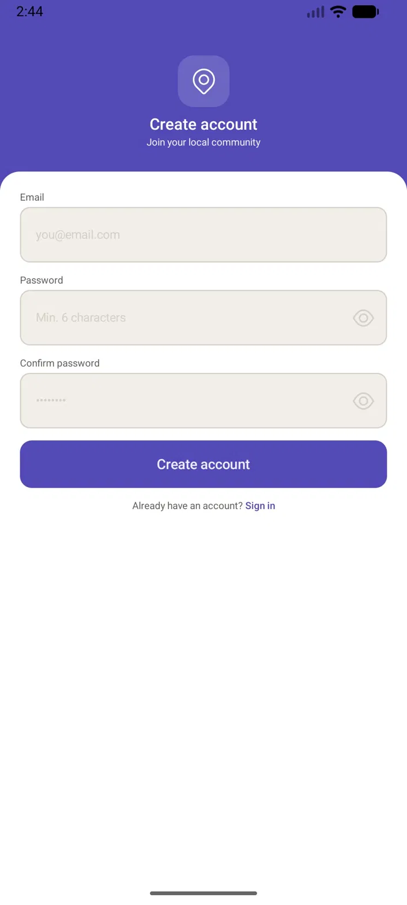
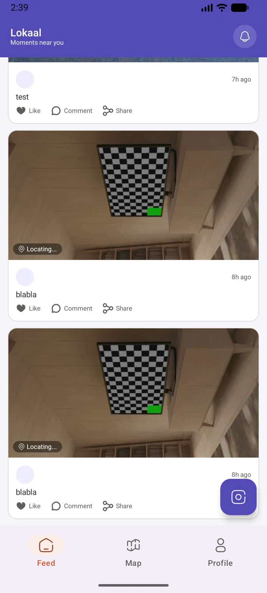
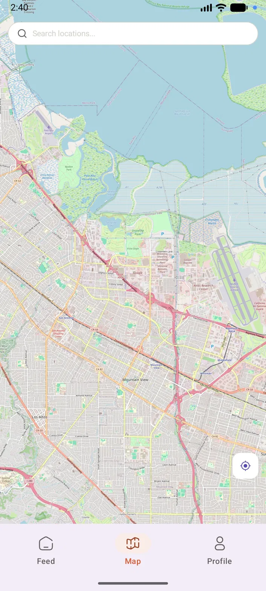
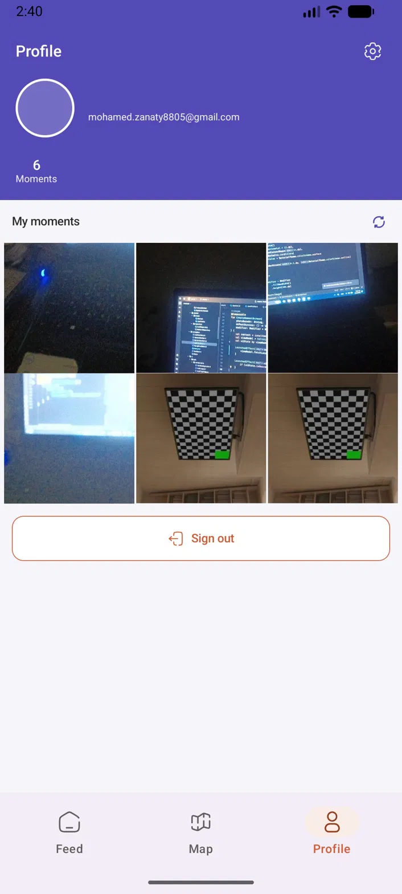
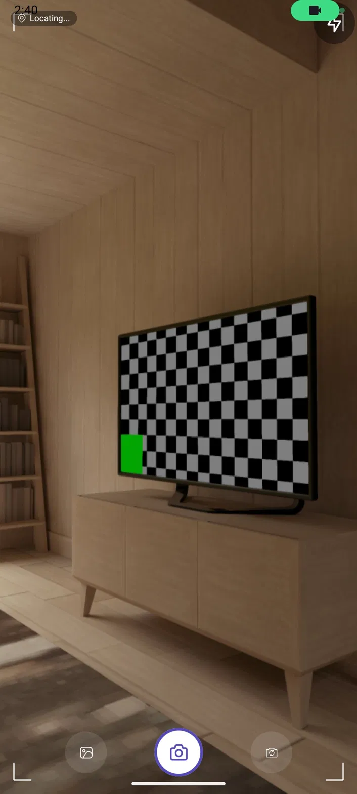

# 📍 Lokaal — Location-Based Social Moments App

A native Android app where users capture moments, pin them to real locations, and discover what's happening nearby — built with **Jetpack Compose** and a full modern Android stack.

> A practice project applying Firebase Auth, Firestore, Paging 3, CameraX, OpenStreetMap, and MVVM end-to-end.

---

## 📱 Screenshots

| Sign In | Sign Up |
|---------|---------|
|  |  |

| Feed | Map |
|------|-----|
|  |  |

| Profile | Camera |
|---------|--------|
|  |  |

---

## ✨ Features

- 🔐 **Authentication** — Sign up and sign in with email and password via Firebase Auth
- 📸 **Camera** — Capture photos using CameraX with live preview and corner guides
- ✏️ **Create Moment** — Post a photo with a caption and your current location
- 📜 **Feed** — Infinite scroll of all moments using Paging 3, newest first
- 🗺️ **Map** — Discover moments pinned on a real OpenStreetMap with marker previews
- 👤 **Profile** — View your own moments in a photo grid with post count
- 💾 **Free photo storage** — Photos stored as Base64 in Firestore, no paid storage needed
- 📍 **Auto location** — Reverse geocoding resolves coordinates to a readable location name

---

## 🏗️ Architecture

This project follows **MVVM (Model-View-ViewModel)** with a **Repository pattern** and **Hilt** for dependency injection.

```
UI Layer
  └── Screens (Stateless Composables)
  └── ViewModels (@HiltViewModel + StateFlow)

Data Layer
  └── MomentRepository (Interface)
  └── MomentRepositoryImpl
        └── Remote: Firestore (moments collection)
  └── AuthRepository (Interface)
  └── AuthRepositoryImpl
        └── Firebase Authentication

Navigation Layer
  └── NavRoot (auth guard)
        ├── AuthNavRoot  (SignIn, SignUp)
        └── MainNavRoot  (Feed, Map, Profile, Camera, CreateMoment)
```

### Data Flow

```
Firebase Auth
    ↓ user signed in
NavRoot → shows MainNavRoot

Camera → captures photo → saved to cache
    ↓
CreateMoment → compress → Base64 → save to Firestore

Firestore (moments collection)
    ↓
MomentsPagingSource → Feed Screen (Paging 3)
    ↓
MomentRepository.getAllMoments() → Map Screen (OSM markers)
    ↓
MomentRepository.getUserMoments() → Profile Screen (grid)
```

---

## 🛠️ Tech Stack

| Technology | Purpose |
|---|---|
| **Jetpack Compose** | Declarative UI |
| **Navigation 3** | Type-safe multi-screen navigation |
| **Hilt** | Dependency injection |
| **Firebase Auth** | User authentication |
| **Firebase Firestore** | Cloud database for moments |
| **CameraX** | Camera capture with lifecycle awareness |
| **Paging 3** | Paginated infinite scroll feed |
| **OpenStreetMap (osmdroid)** | Free map with moment markers |
| **FusedLocationProvider** | Current location + reverse geocoding |
| **ViewModel + StateFlow** | UI state management |
| **Kotlin Coroutines** | Async operations |
| **Material 3** | Design system |
| **Coil** | Async image loading |

---

## 📁 Project Structure

```
com.example.lokaal
│
├── data/
│   ├── model/Moment.kt
│   ├── paging/MomentsPagingSource.kt
│   └── repository/
│       ├── AuthRepository.kt + AuthRepositoryImpl.kt
│       └── MomentRepository.kt + MomentRepositoryImpl.kt
│
├── di/
│   └── AppModule.kt
│
├── ui/
│   ├── screens/
│   │   ├── auth/         (SignInScreen, SignUpScreen, AuthViewModel)
│   │   ├── feed/         (FeedScreen, FeedViewModel)
│   │   ├── map/          (MapScreen, MapViewModel)
│   │   ├── camera/       (CameraScreen, CameraViewModel)
│   │   ├── createmoment/ (CreateMomentScreen, CreateMomentViewModel)
│   │   └── profile/      (ProfileScreen, ProfileViewModel)
│   └── theme/
│       ├── Color.kt
│       ├── Theme.kt
│       └── Type.kt
│
├── navigation/
│   ├── NavRoot.kt
│   ├── AuthNavRoot.kt
│   ├── MainNavRoot.kt
│   ├── NavigationState.kt
│   ├── Route.kt
│   └── BottomNavBar.kt
│
├── utils/
│   ├── AuthErrorMapper.kt
│   ├── AuthValidation.kt
│   └── DateExtensions.kt
│
└── MyApp.kt
```

---

## ⬇️ Download

Try the app directly without building from source:

[**Download APK**](https://github.com/Mohamed8Zanaty/lokaal/releases/latest/download/lokaal.apk)

> **Note:** You may need to enable **"Install from unknown sources"** on your device:
> Settings → Security → Install unknown apps → allow your browser or file manager

---

## 🚀 Getting Started

### Prerequisites
- Android Studio Meerkat or newer
- Android SDK 26+
- A Firebase project with Email/Password auth enabled
- A real Android device (location + camera work best on real hardware)

### Setup

1. Clone the repository
```bash
git clone https://github.com/Mohamed8Zanaty/lokaal.git
```

2. Create a Firebase project at [console.firebase.google.com](https://console.firebase.google.com)

3. Enable **Email/Password** authentication in Firebase Console

4. Download `google-services.json` and place it in the `app/` folder

5. Add your debug SHA-1 fingerprint to Firebase Console:
```bash
./gradlew signingReport
```

6. Sync Gradle and run on a real device

---

## 🔑 Key Implementation Decisions

### Auth Guard with Split NavRoot
Auth flow (`SignIn`, `SignUp`) and the main app (`Feed`, `Map`, `Profile`) live in **completely separate NavDisplays**. This prevents the `Unknown screen` crash that occurs when Navigation 3 encounters a route not registered in the current entry provider.

### Base64 Photos Instead of Firebase Storage
Firebase Storage requires a paid Blaze plan. Photos are compressed to 720px width at 60% JPEG quality and stored as Base64 strings directly in Firestore — well within the 1MB document limit and completely free.

### OpenStreetMap Instead of Google Maps
Google Maps SDK requires billing enabled. The app uses **osmdroid** with OpenStreetMap tiles — entirely free, no API key, no credit card required, and used in production by apps like Telegram and Wikipedia.

### Paging 3 with Firestore Cursor
The feed uses Firestore document snapshots as page cursors. Each page fetches 10 moments ordered by timestamp descending, then passes the last document as the key for the next page — true server-side pagination with no over-fetching.

### Stateless Composables
Every screen composable is fully stateless — receives `UiState` and emits callbacks only. ViewModels own all state. Every screen is independently previewable without runtime dependencies.

### CameraX initializationFuture
The capture button is disabled until `initializationFuture` completes. This prevents the `Not bound to a valid Camera` crash that occurs when `takePicture()` is called before the camera finishes binding to the lifecycle.

---

## 📌 What I Learned

- Setting up **Firebase Auth** end-to-end with Hilt, `Result<T>`, and `callbackFlow`
- Wrapping Firebase calls in `Result<T>` for clean, predictable error handling
- **Paging 3** with a custom `PagingSource` using Firestore cursor-based pagination
- **CameraX** lifecycle binding and `initializationFuture` for safe capture timing
- Replacing **Google Maps** with **OpenStreetMap** using osmdroid — free and production-ready
- **Reverse geocoding** with `Geocoder` for human-readable location names
- Handling the Navigation 3 auth guard pattern correctly to avoid route crashes
- Avoiding nested scrollable composables — using `LazyColumn` with manual row chunking instead of nesting `LazyVerticalGrid` inside `verticalScroll`
- Storing images as Base64 in Firestore as a free alternative to Firebase Storage

---

## 🔮 Coming Features

- [ ] **Unit tests** — ViewModel and Repository coverage with fake repositories
- [ ] **Settings screen** — edit display name, change password, notification preferences
- [ ] **Profile photo** — upload and display a profile picture
- [ ] **Display name on sign up** — set a custom username when creating an account
- [ ] **Likes** — like moments with real-time count updates via Firestore listeners
- [ ] **Comments** — comment on moments with a collapsible bottom sheet
- [ ] **Delete moment** — remove your own moments from feed and profile
- [ ] **Moment detail screen** — full screen view with comments and map location
- [ ] **Search** — search moments by location name or caption keyword
- [ ] **Push notifications** — notify users when someone likes their moment
- [ ] **Cloudinary integration** — replace Base64 with proper cloud image hosting
- [ ] **Dark mode** — full dark theme support
- [ ] **Offline feed caching** — cache moments locally with Room for offline reading

---

## 📄 License

This project is open source and available under the [MIT License](LICENSE).